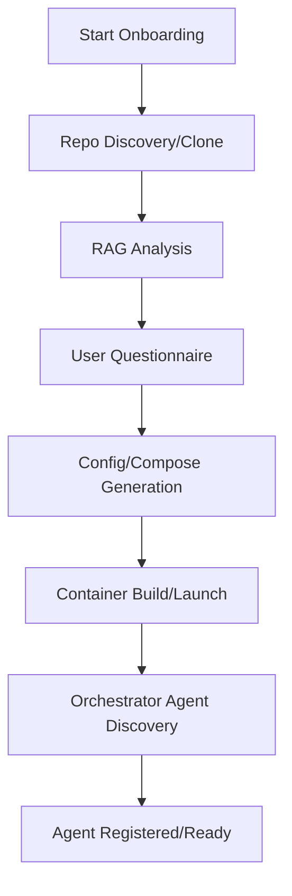

# MCP RAG Army Onboarding: Technical Flow & Checklist

## Overview
This document describes the technical onboarding flow for adding new Docker/RAG/Pydantic AI/A2A agents to the MCP server (orchestrator). It includes a checklist, flowchart, and integration details to ensure seamless agent registration and orchestrator discovery.

---

## Step-by-Step Onboarding Flow

1. **Repo Discovery & Acquisition**
   - [ ] Scan for available repos in `docker_repos/`
   - [ ] If missing, prompt user for repo URL(s) and auto-clone

2. **RAG Analysis & Config Extraction**
   - [ ] Use RAG/AI to analyze repo structure
   - [ ] Identify Dockerfile, `.env.example`, agent card template, and config needs

3. **Interactive User Questionnaire**
   - [ ] Prompt for:
     - Network name
     - Agent name
     - Port
     - System prompt
     - A2A agent card details
     - Repo selection
   - [ ] For each `.env.example`, extract required variables and prompt for values (e.g., API keys)

4. **Automated Config & Compose Generation**
   - [ ] Write/update `docker-compose.yml` (add agent service)
   - [ ] Generate agent config files (system prompt, agent card, etc.)
   - [ ] Create `.env` file(s) populated with user input

5. **Container Build & Launch**
   - [ ] Run `docker-compose up --build` to start all agents

6. **Automatic Orchestrator Discovery & Registration**
   - [ ] Orchestrator scans Docker network for new/running agents
   - [ ] Reads agent card metadata (via endpoint or file)
   - [ ] Registers agent and makes it available for task delegation/A2A

7. **Agent Testing & Benchmarking**
   - [ ] Orchestrator sends a test prompt to the new agent
   - [ ] Agent's response is displayed to the user for confirmation
   - [ ] Orchestrator benchmarks the agent (latency, correctness, resource usage)
   - [ ] Benchmark results and a final 'Agent is ready' message are shown to the user

7. **Ready for Use**
   - [ ] Orchestrator can now route requests to the new agent(s)
   - [ ] User can interact with the system via the unified endpoint

---

## Flowchart

---

## Integration Details
- **Agent Card:** Each agent exposes a JSON file or endpoint with metadata (name, capabilities, endpoints)
- **Orchestrator:** Periodically or on-demand scans for new agents, reads their agent cards, and registers them
- **All config and onboarding steps are version-controlled and reproducible**

---

## Best Practices
- Always keep `docker_repos/` up to date
- Use `.env.example` as a template for onboarding secrets/keys
- Document new agent onboarding in `progress.md` and `activeContext.md`

---

For more details, see the technical flow in `feature_specs.md` and the project overview in `projectbrief.md`.
